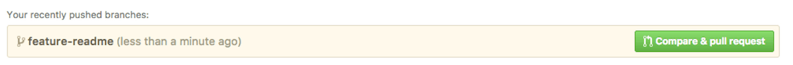
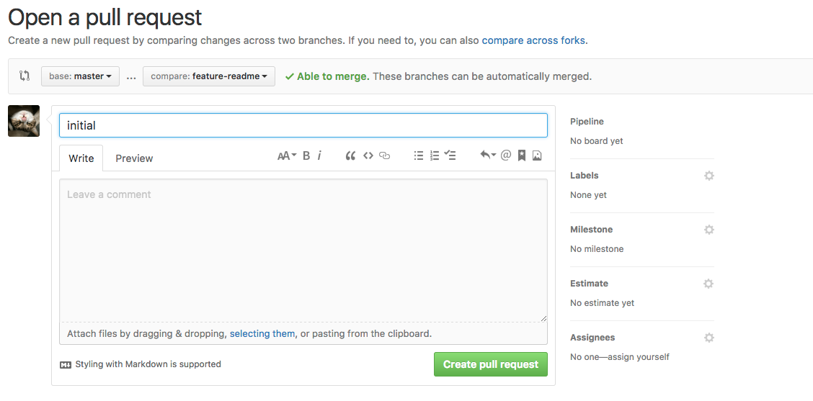
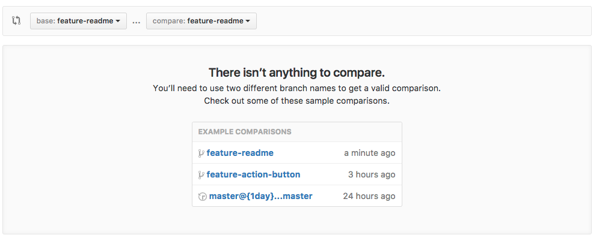
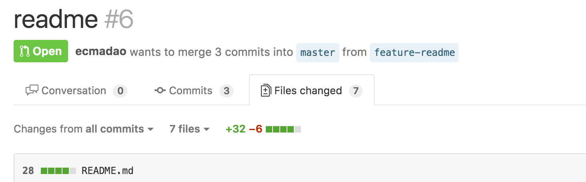
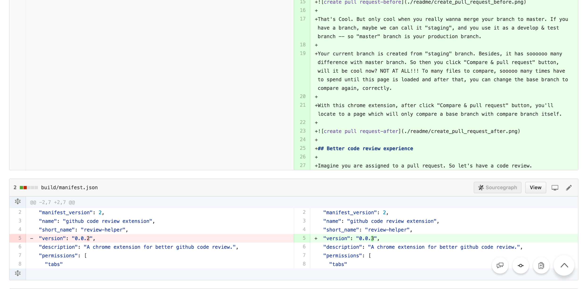
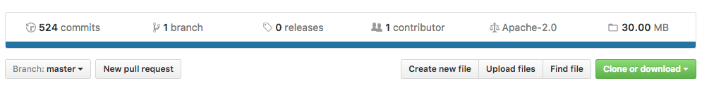

> A chrome extension for better github experience.

[中文版介绍](./README_CN.md)

## Feature

### Create a pull request

when you push a new branch to a repository, you will see this in blew:



Then you may click "Compare & pull request" button, and locate to that page:



It's Cool😝. But only cool when you really wanna merge your branch to master. If you have a branch, maybe we can call it "staging", and you use it as a develop & test branch -- so "master" branch is your production branch🤔.

Your current branch is created from "staging" branch. Besides, it has soooooo many difference with master branch. So then you click "Compare & pull request" button, will it be cool now? NOT AT ALL!!!🙄 To many files to compare, sooooo many times have to spend until this page is loaded. After that, you have to change the base branch to compare again, correctly😞.

With this chrome extension, after click "Compare & pull request" button, you'll locate to a page which will only compare a base branch with compare branch itself.



### Better code review experience

Imagine you are assigned to a pull request. So let's have a code review.

It is a really really long review, man, and you have no choice but hold on. It seems after hundred of centuries, you scroll to the end of the page! In the end, you have only one task to do -- scroll to the top, click "conversation" button in the navbar, then leave your conversation or merge this request.



With this chrome extension, you'll have a action button on this page at bottom right corner. By using that, you can quickly scroll to top, locate to "conversation" page or "commits" page or "files change" page😝.



they have same func with navbar.

### show similar repos

It's not so accurate at this time, just for fun😆.

It will search and get six most stared repos by repository name and language.


### show repos size



## Playground

- clone & build

```bash
$ git clone https://github.com/ecmadao/github-extension.git
$ cd github-extension
$ npm i
$ npm run build
```

- locate your chrome to [chrome://extensions](chrome://extensions/)
- open "developer mode"
- click "load unpacked", then load "build" folder in this repository

## ToDo

- [x] show similar repositories in a repository main page
- [x] show current page in action button when code review
- [x] show repository size

## Author

[ecmadao](https://github.com/ecmadao)

## License

MIT

--------------------------------------------------------------------------------

Enjoy!
